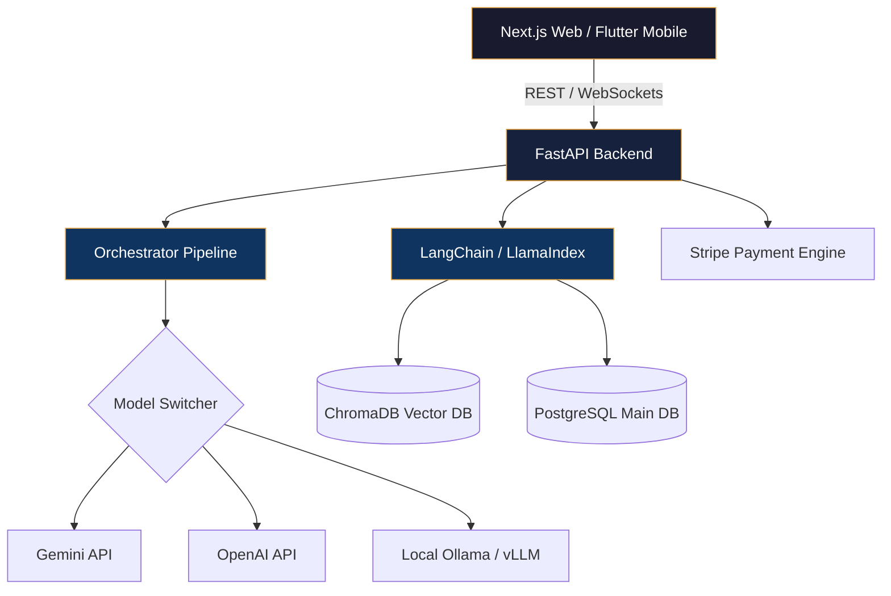

<!-- ═══════════════════════════════════════════════════════════════════════════ -->
<!-- ANIMATED HEADER -->
<!-- ═══════════════════════════════════════════════════════════════════════════ -->


<!-- ═══════════════════════════════════════════════════════════════════════════ -->
<!-- TYPING ANIMATION -->
<!-- ═══════════════════════════════════════════════════════════════════════════ -->

<p align="center">
  <a href="https://git.io/typing-svg">
    
  </a>
</p>

<!-- ═══════════════════════════════════════════════════════════════════════════ -->
<!-- BADGES ROW -->
<!-- ═══════════════════════════════════════════════════════════════════════════ -->

<p align="center">
  
  &nbsp;
  <a href="https://github.com/devplabon?tab=followers">
    
  </a>
  &nbsp;
  <a href="https://github.com/devplabon?tab=repositories&sort=stargazers">
    
  </a>
</p>

<p align="center">
  <a href="https://linkedin.com/in/plaabon"></a>
  <a href="https://plaabon.com"></a>
  <a href="mailto:plaabon@outlook.com"></a>
</p>

---

<!-- ═══════════════════════════════════════════════════════════════════════════ -->
<!-- ABOUT ME -->
<!-- ═══════════════════════════════════════════════════════════════════════════ -->

##  &nbsp;About Me

```yaml
name: Muhammad Plaabon
location: Dhaka, Bangladesh
role: Full-Stack Software Engineer
experience: 5+ years
focus: AI-Powered SaaS Platforms x Cross-Platform Mobile Apps

currently_building:
  - "MindForge AI — Multi-tenant AI SaaS (Next.js + FastAPI + ChromaDB + LangChain)"
  - "VeloxMart — Multi-Vendor eCommerce Platform (Flutter + Next.js + Node.js + PostgreSQL)"
  - "ServTable — SaaS Restaurant POS System (Flutter + React + Node.js + Socket.IO)"

career_highlights:
  - "Transitioned from high-impact UI/UX Design to robust Full-Stack Software Engineering"
  - "Architected and shipped production Flutter & Laravel applications for global clients"
  - "Managed enterprise-level IT infrastructure at Robi Axiata Limited"
  - "Unique edge: Writing clean, developer-quality code with designer-quality user experiences"

industries_served:
  - FinTech        # Secure foreign exchange (Skyline Software Labs / Danesh Exchange)
  - AgriTech       # AI farming platform (Krishok AI / farmers solutions)
  - EdTech         # Multilingual eBook reader (Porua.org) & exam preparation platforms
  - eCommerce      # Advanced multi-vendor SaaS marketplaces
  - Logistics      # SwiftParcel logistics and courier delivery systems
  - Enterprise     # POS, internal workflow management, and CRM

languages_spoken:
  - Bengali (Native)
  - English (Professional — IELTS 6.5)
  - Hindi (Conversational)

fun_facts:
  - "🔭 Passionate about system flow design & software architecture"
  - "🎨 Early background in professional graphics & brand design"
  - "📸 Photography lover"
  - "🧩 Open source contributor & LLM / RAG explorer"
```

---

<!-- ═══════════════════════════════════════════════════════════════════════════ -->
<!-- TECH STACK -->
<!-- ═══════════════════════════════════════════════════════════════════════════ -->

## ⚡ Tech Stack

<table>
<tr>
<td align="center" width="20%"><b>🎯 Mobile & Design</b></td>
<td align="center" width="20%"><b>🤖 AI / ML</b></td>
<td align="center" width="20%"><b>🌐 Frontend</b></td>
<td align="center" width="20%"><b>⚙️ Backend</b></td>
<td align="center" width="20%"><b>🛠️ DevOps & Data</b></td>
</tr>
<tr>
<td align="center">


</td>
<td align="center">


</td>
<td align="center">


</td>
<td align="center">


</td>
<td align="center">


</td>
</tr>
</table>

---

<!-- ═══════════════════════════════════════════════════════════════════════════ -->
<!-- FLAGSHIP PROJECT — MINDFORGE AI -->
<!-- ═══════════════════════════════════════════════════════════════════════════ -->

## 🧠 Flagship: MindForge AI — Multi-Tenant AI SaaS Platform

> **A cutting-edge SaaS platform enabling businesses to deploy custom RAG chatbots, generate high-quality AI copy, and manage usage/billing seamlessly.**

<table>
<tr>
<td width="55%">

**Core Capabilities:**
- 🤖 **Custom Knowledgebase (RAG):** Upload PDFs/documents, auto-chunk, embed, and query with source citations.
- 🏢 **Multi-Tenancy Engine:** Complete team workspace separation, token-based usage tracking, and automated Stripe billing tiers.
- ✍️ **Content Studio:** Generative writing tool for blogs, social copy, and SEO meta details with custom tone controls.
- 🎨 **Image Studio:** Integrated text-to-image pipeline via DALL-E 3 & Stable Diffusion APIs.
- 🔧 **Hybrid Model Backend:** Instant swap between commercial APIs (OpenAI/Gemini) and self-hosted models (Ollama/vLLM) for enterprise privacy.

**Architecture:**
- **Frontend:** Next.js · TypeScript · Tailwind CSS · React Context
- **Mobile Companion:** Flutter · Riverpod state management
- **Backend API:** FastAPI (Python) · LangChain orchestrator
- **Vector Search:** ChromaDB · Pinecone · FAISS
- **Queue & Cache:** Redis · BullMQ background tasks

</td>
<td width="45%">



</td>
</tr>
</table>

---

<!-- ═══════════════════════════════════════════════════════════════════════════ -->
<!-- FULL PROJECT PORTFOLIO -->
<!-- ═══════════════════════════════════════════════════════════════════════════ -->

## 🚀 Signature Projects

### 📱 Full-Stack SaaS Ecosystems

<table>
<tr>
<td width="50%">

#### 🛒 VeloxMart
**Multi-Vendor eCommerce Platform**

Complete multi-vendor marketplace with customer mobile app, vendor management panel, admin dashboard, and scalable backend API.

`Flutter` `Next.js` `Node.js` `PostgreSQL` `Redis` `Stripe`

</td>
<td width="50%">

#### 🍽️ ServTable
**Restaurant SaaS POS System**

Multi-tenant restaurant operating system featuring real-time waiter POS app, kitchen display manager, QR-code digital menus, and business analytics.

`Flutter` `React` `Node.js` `PostgreSQL` `Socket.IO` `Stripe`

</td>
</tr>
<tr>
<td width="50%">

#### 🧠 MindForge AI
**AI SaaS Platform**

Custom RAG chatbot deployment, document semantic search, AI generative writing suite, and secure multi-tenant usage-based billing.

`FastAPI` `Next.js` `Flutter` `ChromaDB` `LangChain` `Docker`

</td>
<td width="50%">

#### 📦 SwiftParcel
**Logistics & Courier Delivery System**

End-to-end delivery framework with merchant portals, rider navigation dashboards, administrative control portals, and automated route dispatch.

`Flutter` `Vue.js` `Node.js` `PostgreSQL` `PostGIS` `Socket.IO`

</td>
</tr>
</table>

### 💎 Early Digital Products

<table>
<tr>
<td width="33%">

#### 🛍️ Pixora
**Digital Product Marketplace**

Creators' marketplace for software, assets, and templates featuring S3 secure downloads, license key generator, and Stripe Connect.

`Next.js` `Flutter` `FastAPI` `Elasticsearch` `AWS S3`

</td>
<td width="33%">

#### 📖 Porua.org
**Digital eBook Platform**

Secure eBook publishing and reading application with end-to-end content encryption, anti-piracy controls, and multi-currency payments.

`Flutter` `Laravel` `Firebase` `Python` `MySQL`

</td>
<td width="33%">

#### 💳 Tcard
**NFC Contactless Payments**

NFC-based local payment card system with instant transaction logging, secure card reading, and Firebase real-time database sync.

`Flutter` `NFC Tools` `Firebase` `Laravel` `MySQL`

</td>
</tr>
</table>

---

<!-- ═══════════════════════════════════════════════════════════════════════════ -->
<!-- PROFESSIONAL EXPERIENCE TIMELINE -->
<!-- ═══════════════════════════════════════════════════════════════════════════ -->

## 💼 Professional Journey

```
2025 ─── Present    🏢 Senior Software Engineer — NovaCraft Digital Solutions (UK Remote)
                    ├── Architected 5+ AI-powered Flutter mobile applications
                    ├── Designed MindForge AI (FastAPI + ChromaDB) & Krishok AI
                    └── Spearheaded team migration to high-performance microservices

2023 ─── 2024      🏢 Full-Stack Mobile Developer — BioPhan Tech Ltd
                    ├── Developed Porua.org multilingual eBook platform with PDF encryption
                    └── Launched Tcard NFC-based smart contactless payment system

2022 ─── 2023      🏢 Flutter App Developer — Skyline Software Labs (Australia Remote)
                    ├── Designed foreign exchange banking-grade app (AES-256)
                    └── Integrated systems with 3,000+ Australia Post locations

2020 ─── 2022      🏢 Mobile App Developer & IT Systems Engineer — Robi Axiata Limited
                    ├── Developed internal mobile integrations and Python web scrapers
                    └── Administered enterprise network infrastructure & system operations

2014 ─── 2020      🚀 UI/UX Engineer & Frontend Developer (SureSoft / Pick N Drop / SJ Innovation)
                    ├── Transitioned from senior product designer to software engineer
                    ├── Developed web/mobile frontends and custom database management tools
                    └── Consulted for international clients via freelance channels
```

---

<!-- ═══════════════════════════════════════════════════════════════════════════ -->
<!-- GITHUB STATS -->
<!-- ═══════════════════════════════════════════════════════════════════════════ -->

## 📊 GitHub Analytics

<p align="center">
  
  
</p>

<p align="center">
  
</p>

---

<!-- ═══════════════════════════════════════════════════════════════════════════ -->
<!-- CONNECT -->
<!-- ═══════════════════════════════════════════════════════════════════════════ -->

## 🤝 Let's Connect

<p align="center">
  <a href="mailto:plaabon@outlook.com"></a>
  <a href="https://linkedin.com/in/plaabon"></a>
  <a href="https://plaabon.com"></a>
  <a href="https://github.com/devplabon"></a>
</p>

<p align="center">
  <i>"I bridge the gap between high-performance backends and intuitive user interfaces — creating software that feels alive."</i>
</p>

<!-- 3D CONTRIBUTION MAP -->
<!-- ═══════════════════════════════════════════════════════════════════════════ -->

<p align="center">
  
</p>

<!-- ═══════════════════════════════════════════════════════════════════════════ -->
<!-- FOOTER -->
<!-- ═══════════════════════════════════════════════════════════════════════════ -->


